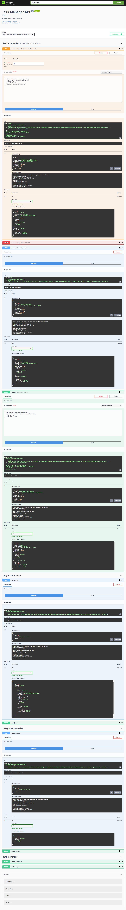
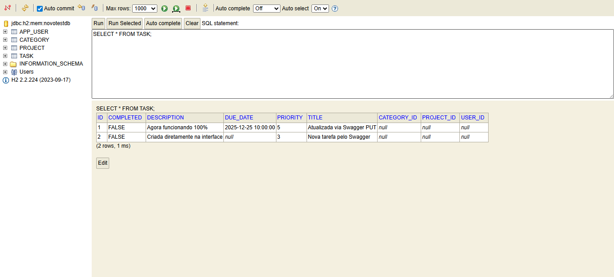
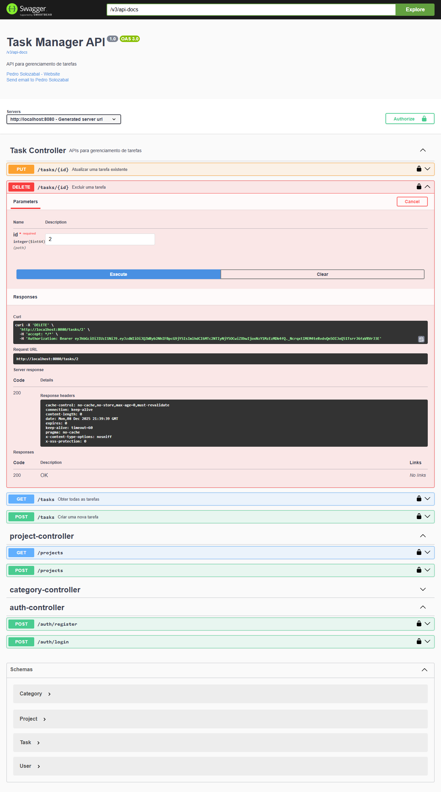
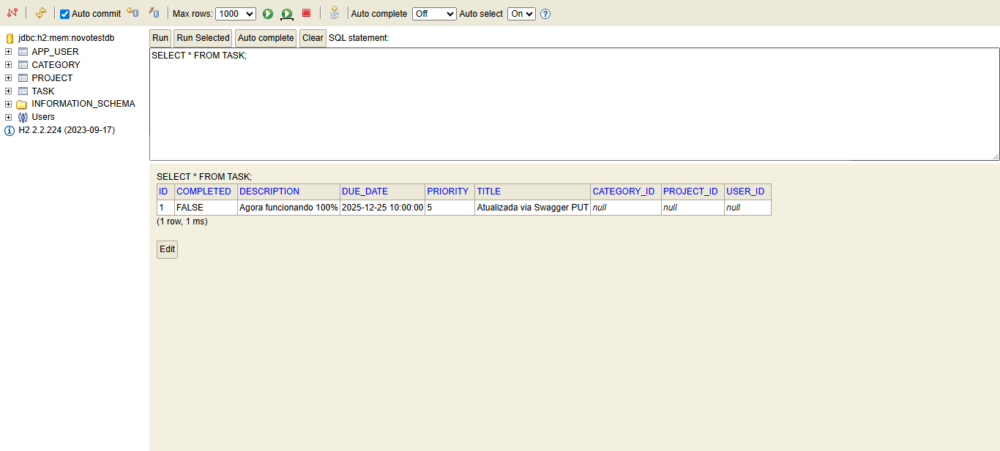

# 🧭 DIO Task Manager - Santander Bootcamp 🚀

[](https://www.oracle.com/java/)
[](https://spring.io/projects/spring-boot)
[](https://www.h2database.com)
[](https://hibernate.org)
[](https://maven.apache.org)
[](https://jwt.io)
[](https://jakarta.ee/specifications/persistence/)

---

## 📄 Overview

**DIO Task Manager** is a fully featured, secure, and extensible task management REST API built for practice during the Santander Bootcamp by [DIO](https://www.dio.me/). The project evolved from a basic Spring Boot scaffold into a robust application with multi-entity relations, JWT authentication, and complete CRUD integrations.

---

## ✨ What Has Changed?

|                     | 🏁 **Initial Repo**   | 🏆 **Current Version**            |
|---------------------|----------------------|-----------------------------------|
| **Entities**        | Task only            | Task, User, Category, Project     |
| **Auth**            | None                 | JWT-based secure login/register   |
| **Endpoints**       | Basic GET/POST       | Full CRUD for all entities        |
| **Docs**            | None                 | Interactive Swagger UI            |
| **DB**              | H2 basic             | H2 with relational mapping        |
| **Features**        | Simple OOP           | Validation, filtering, security   |
| **Error Handling**  | Basic                | Full validation, custom errors    |

---

## ⚙️ Tools & Technologies

- **Java 21 LTS** (2024-10-15)
- **Spring Boot 3.3.4**
- **Spring Data JPA**
- **Hibernate ORM**
- **JWT (JSON Web Token) Authentication**
- **Maven Build**
- **H2 In-Memory Database**
- **OpenAPI / Swagger v3 Docs**

---

## 💡 Project Highlights & Differentials

- **🔒 Security-first:** Stateless JWT authentication for endpoints.
- **🧑‍💻 OOP & Layered Architecture:** Entities, Repositories, Controllers, Services all separated for clarity.
- **📚 Self-documenting code:** Swagger/OpenAPI docs auto-generated and browsable.
- **🛡️ Validation:** Full validation on entities (priority, titles, date ranges etc).
- **🔀 DTO-free simplicity:** Model classes used directly as payloads for ease of demo/testing.
- **⚡ Quick boot:** Integrated H2 + Swagger means you can experiment and reset as much as you like.
- **🔗 Relationships:** Each task can be bound to User, Category, and Project, providing full relational flexibility.
- **🖼️ Visual feedback:** Database and API state can be visually inspected (see screenshots).

---

## 🔥 Important Code Snippets

### JWT Authentication Filter
```java
// src/main/java/com/dio/config/JwtAuthFilter.java
@Override
protected void doFilterInternal(HttpServletRequest request, HttpServletResponse response, FilterChain filterChain)
        throws ServletException, IOException {
    final String authHeader = request.getHeader("Authorization");
    if (authHeader == null || !authHeader.startsWith("Bearer ")) {
        filterChain.doFilter(request, response);
        return;
    }
    String jwt = authHeader.substring(7);
    String username = jwtService.extractUsername(jwt);
    if (username != null && SecurityContextHolder.getContext().getAuthentication() == null) {
        UserDetails userDetails = userDetailsService.loadUserByUsername(username);
        if (jwtService.validateToken(jwt, userDetails)) {
            UsernamePasswordAuthenticationToken authToken =
                    new UsernamePasswordAuthenticationToken(userDetails, null, userDetails.getAuthorities());
            authToken.setDetails(new WebAuthenticationDetailsSource().buildDetails(request));
            SecurityContextHolder.getContext().setAuthentication(authToken);
        }
    }
    filterChain.doFilter(request, response);
}
```

### Entity Relationship Example (Task)
```java
// src/main/java/com/dio/model/Task.java
@Entity
@Table(name = "task")
public class Task {
    @Id
    @GeneratedValue(strategy = GenerationType.IDENTITY)
    private Long id;

    @Column(nullable=false, length=100)
    private String title;
    private String description;
    private LocalDateTime dueDate;
    private int priority;
    private boolean completed;

    @ManyToOne
    @JoinColumn(name = "category_id")
    private Category category;
    @ManyToOne
    @JoinColumn(name = "project_id")
    private Project project;
    @ManyToOne
    @JoinColumn(name = "user_id")
    private User user;
}
```

### Task Validation Logic
```java
// src/main/java/com/dio/service/TaskManager.java
private void validateTask(Task task) {
    if (task.getTitle() == null || task.getTitle().isEmpty())
        throw new IllegalArgumentException("O título da tarefa não pode ser vazio");
    if (task.getTitle().length() > 100)
        throw new IllegalArgumentException("O título da tarefa não pode ter mais de 100 caracteres");
    if (task.getDescription() != null && task.getDescription().length() > 500)
        throw new IllegalArgumentException("A descrição da tarefa não pode ter mais de 500 caracteres");
    if (task.getDueDate() != null && task.getDueDate().isBefore(LocalDateTime.now()))
        throw new IllegalArgumentException("A data de vencimento não pode ser no passado");
    if (task.getPriority() < 1 || task.getPriority() > 5)
        throw new IllegalArgumentException("A prioridade da tarefa deve estar entre 1 e 5");
}
```

### Controller Example (Auth/Register)
```java
// src/main/java/com/dio/controller/AuthController.java
@PostMapping("/register")
public ResponseEntity<?> register(@RequestBody User user) {
    User registeredUser = userService.registerUser(user);
    return ResponseEntity.ok(Map.of(
            "message", "Usuário registrado com sucesso",
            "username", registeredUser.getUsername()
    ));
}
```

---

## 📁 Project Directory Structure

```plaintext
dio-santander-bootcamp-task-manager-springboot/
├── assets/
│   ├── h2-database-screenshot.png
│   ├── h2-database-screenshot-delete.png
│   ├── swagger-screenshot.png
│   └── swagger-screenshot-delete-endpoint.png
├── src/
│   └── main/
│       ├── java/
│       │   └── com/
│       │       └── dio/
│       │           ├── config/
│       │           │   ├── JwtAuthFilter.java
│       │           │   ├── SecurityConfig.java
│       │           │   └── SwaggerConfig.java
│       │           ├── controller/
│       │           │   ├── AuthController.java
│       │           │   ├── CategoryController.java
│       │           │   ├── ProjectController.java
│       │           │   └── TaskController.java
│       │           ├── model/
│       │           │   ├── Category.java
│       │           │   ├── Project.java
│       │           │   ├── Task.java
│       │           │   └── User.java
│       │           ├── repository/
│       │           │   ├── CategoryRepository.java
│       │           │   ├── ProjectRepository.java
│       │           │   ├── TaskRepository.java
│       │           │   └── UserRepository.java
│       │           ├── service/
│       │           │   ├── CustomUserDetailsService.java
│       │           │   ├── JwtService.java
│       │           │   ├── TaskManager.java
│       │           │   └── UserService.java
│       │           └── TaskManagerSystemApplication.java
│       └── resources/
│           └── application.properties
├── .gitignore
├── pom.xml
└── README.md
```
- **/assets:** Project screenshots for visual documentation.
- **/src/main/java/com/dio/config:** Security and Swagger configurations.
- **/src/main/java/com/dio/controller:** REST controllers for each entity.
- **/src/main/java/com/dio/model:** Entity classes (JPA models).
- **/src/main/java/com/dio/repository:** Spring Data interfaces.
- **/src/main/java/com/dio/service:** Service layer and business logic.
- **/src/main/java/com/dio/TaskManagerSystemApplication.java:** Main application entrypoint.
- **/src/main/resources/application.properties:** Database and Spring config.
- **pom.xml:** Project dependency management.
- **README.md:** Project documentation.

---

## 🖼️ Screenshots & API in Action

### Swagger UI — Interactive API Docs


### H2 Database — Inspecting Tasks


### Swagger UI — Deleting a Task, Example


### H2 Database — After Delete Operation


*Each screenshot demonstrates real-world usage and verifies the correct working of CRUD functionality and secure endpoints.*

---

## 📚 How to Run This Project

```bash
# Clone the repository
git clone https://github.com/solozabal/dio-santander-bootcamp-task-manager-springboot.git

# Enter the project folder
cd dio-santander-bootcamp-task-manager-springboot

# Build and run
mvn spring-boot:run
```

The API will be available at:
- `http://localhost:8080/swagger-ui/index.html` (Swagger UI - interactive API docs)
- `http://localhost:8080/h2-console` (Access H2 DB console)

---

## 📦 API Endpoints

- `/auth/register` — Register new user
- `/auth/login` — User login (JWT)
- `/tasks` — CRUD for tasks
- `/projects` — CRUD for projects
- `/categories` — CRUD for categories

Each endpoint requires JWT authentication (except `/auth/**` and public docs via Swagger).

---

## 🚩 Known Issues & Next Improvements

- Add DTOs for better API decoupling
- Enhance error messages and validation feedback
- Implement pagination & sorting in GET endpoints
- Integrate frontend (Angular/React) sample app
- Implement tests

---

## 📄 License

Licensed under the [MIT License](LICENSE).

---

<p align="center">
  <a href="https://www.linkedin.com/in/pedrosolozabal/">
    
  </a>
</p>
